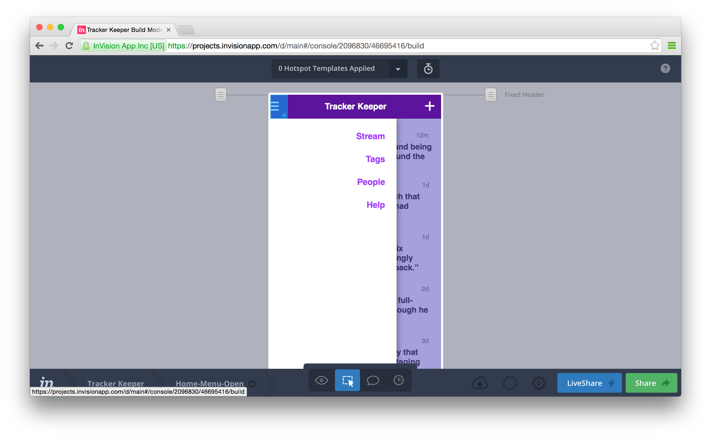

# Live mockups with Sketch and InVision

Websites (and apps) ain't what they used to be. Our builds have grown from static pages and views into complex, moving systems. To keep pace, our mockups need to evolve as well.

## Introduction

Gone are the days of delivering a single PSD and calling it a day. Modern designers are expected to deliver **systems**, usually a complex series of design elements, styles, and interactions.

Add a non-technical stakeholder or manager in the mix, and getting sign-off for a complex app or user process gets pretty dang sticky, and quick. We've got drawers that open and modals that cover and forms that are dynamic and soon someone around the meeting table won't quite be able to picture it.

The solution, simply, is to up your game. With a little wrangling, our mockups can move, show complete user paths, cover the ins and outs— they can come to life.

My favorite two tools for building living prototypes are Sketch and InVision. Sketch, the Mac graphic design application that's taking the world by storm, and InVision, the browser-based design collaboration platform, are a match made in heaven.

We use both full-time at The Zebra, an insurance startup where my team of designers, developers, and product people use countless prototypes to envision new features, new pages, even whole redesigns.

For this lesson, we're going to build an imaginary status tracker, a tool for folks in our office to log recognitions or words of praise for each other (sort of like an internal, super-positive Twitter). We'll build a home view with generic social timeline, along with a menu that opens and closes.

Let's do this!

### Step 1

Create a new .sketch document. Inside, we're going to make two artboards, one for the normal home view, and one for the open menu view. Press "A" to bring up the Artboard tool, which has some popular screen resolutions built-in. Select "iPhone Portrait".

Click anywhere in your canvas to create a new artboard. Rename it to "home". This artboard will be the "home view" of your app. Press CMD+D to duplicate the artboard, and change the newly created screen's name to "home-menu-open".

### Step 2

Inside the "home" artboard, we're going to create a standard app header. Press "R" to select the Rectangle tool, and draw out a 640x90 rectangle at the top of the artboard. Rename this shape "header-bg".

### Step 3

Sketch's right palette is called The Inspector, and it's where you'll find all the properties of shapes, text, groups, and more.

With the "header-bg" object selected, let's turn off the border and pick a fill. My app is flashy, so I've picked a neon gradient. Dannnng!

While we're at it, let's select our artboards and set a background color, white. Also check the "Include in export" option, which will make sure our app screens don't come out transparent.

### Step 4

To create the rest of the header, let's add a menu icon, and app title, and an action button.

I'm making my hamburger icon from scratch, simple drawing out three rectangles. I'll also group them for easy positioning (slightly off the left edge).

Press "T" to enter some text, and key in the title of your app. I'm building an internal activity tracker, so I'm going with "Tracker Keeper". The font size/color/spacing is located in The Inspector panel on the right.

On the right of the header side, I've added a "plus" icon, which would let the user add an activity to the stream. Again, I've simply drawn this icon myself with the rectangle tool.

### Step 5

Once our header is done, we're going to convert it into a Symbol, which means we'll be able to use it again and again around our .sketch document. By converting our header into a Symbol, we can apply it to the second screen, resting assured that any changes to either header will result in the opposite header staying in sync.

Let's group all the objects we just created, and turn them into a symbol. Select the rectangle, icons, and text we just created and press (CMD+G). We'll want to rename this group to something sensical, so let's press (CMD+R) and rename to "header".

In the Layers List, right click on your "header" group and pick "Create Symbol". A Symbol is denoted in the Layers List by a purple-colored folder. Keep a keen eye on all purple folder, as changing one will result in all others being updated. With great power comes great responsibility. 

### Step 6

Still on tthe "home" artboard, we can start to build our activity timeline. This example app will collect and display recognitions/congratulations from one team member to another.

Let's make a single comment. I'll make a circle using the Oval tool, and place an icon inside using Symbolset (one of my favorite font tools). I'll also add some text and a timestamp.

### Step 7

Like we did with the header, let's round up the elements we just created and turn them into a group (CMD+G). Rename the group to "comment", then turn it into a symbol.

With the "comment" symbol selected, choose Arrange > Make Grid. We're going to make a grid with 5 rows (spaced 40px) and 1 column (which will give us a single stack of comments, ala Twitter).

### Step 8

For the sake of making an interesting mockup, let's change the comment text inside each instance of the symbol. To do so, simply select the text layer, and find the "Exclude Text Value From Symbol" checkbox in the Inspector Palette. 

Go down the line and change each comment to something inspirational and more becoming of an awesome startup. Along these lines, I'm also changing each time stamp and set of names.

### Step 9

With your basic home screen complete, we're going to copy the entire screen into your other artboard, "home-menu-open". Simply just select all our current elements (CMD+A or click and drag to select) and then duplicate (CMD+D). Drag your new layers into the "home-menu-open" artboard.

Since everything we just duplicated is a symbol, any changes you make on the "home" artboard will be immediately reflected on the "home-menu-open" artboard (and vice versa).

### Step 10

For our sample app, we're going to make a pretty simple menu. Using the rectangle tool, I'll draw two shapes: a white box on the left side of the screen, and a colored box on the right (to be the overlay).

Using the text tool, let's add some menu items to our fake app. We're getting close to making this thing come alive!

### Step 11

With Sketch, exporting screens (and assets, slices, etc) is super easy. Simply select our artboards in the Layers List, then find "Export" over in the left Inspector palette. 

Since we already have our artboards sized correctly, let's just go with 1x PNG files. If you were making real assets, here's where you can crank out all your varying sizes and formats. Handy!

### Step 12

Now that we're jussssst about ready to save our screens as PNGs, let's log into InVision and make a project to hold them. After you make your "Tracker Keeper" project, make sure you grab the InVisionSync app while you're there (you can also upload through the web, but the Sync app does such a nice job helping things along.)

### Step 13

Back inside Sketch, we're going to export our artboards as PNGs. You can do this from the bottom of the Inspector palette, or with the "Export" button in the right of the main toolbar. 

When exporting multiple artboards, the file names will be the same as the artboard name. This makes for some nice parity between your Sketch document and the names of screens inside InVision.

Save the PNGs inside your InVision folder, where you'll find a newly created "Tracker Keeper" folder, along with a "Screens" folder inside.

### Step 14

Once InVision has the screens uploaded, head back into the web interface and open the project. While viewing the main screen, we're going to enter "Build Mode", either with the icon in the bottom center of the screen or by pressing "B".

With Build Mode active, we're going to click and drag and blue highlight around our menu button. This hotspot is the key to creating a living mockup out of flat PNGs. Essentially, we're making a fancy image map, with actions tied to each hotspot we build.

We're going to link our new hotspot our a "home-menu-open" screen. Since our menu is designed like an off-canvas tray, let's select a "Push Right" animation.

### Step 15

Hop back into Preview Mode, either with the icon in the bottom center of the screen or by pressing "P", and test the new hotspot. Clicking it should make the menu open.

Now viewing the "menu-home-open" screen, let's make another hotspot that lets people hide the menu. Enter Build Mode, draw out a new hotspot, and link it back to the "home" screen.

### Step 16

Now would be a good time to check this out on your actual device. Either click "Share" and grab yourself the link, or use the SMS service to send a link right to your phone.

Once you open the link, make sure to "Add to Home Screen" to get the full effect (InVision lets you set an icon, startup image, etc).

### Step 17

You know what? Now that I see this on my device, that neon bar in the header is a bit too loud. Let's hop back into Sketch and turn it down, making it a nice deep purple.

Of course, when you edit the header symbol in one place, it automatically updates subsequent instances. And no, I don't really care about the purple, I just wanted to show you how easy it is to manage changes within your living mockup.

### Step 18

Select your artboards again, and let's export. Save them to the same folder as before, replacing the old files, and InVision will do the rest. You're updated look with purple header will automatically show up in all InVision mockups, even those being viewed on a mobile device (or live in browser).

### Step 19

Of course, all your hotspots and settings for each screen will remain intact, meaning you can change out design details or even whole screens and still have a clickable, live prototype.

### Step 20

That's mostly it, now you just rinse and repeat. Make changes, see them live, on your device, share them with people.

### Tip 1

Symbols are reusable elements that stay in sync across your Sketch document's pages and artboards. They are super handy for designing things like timelines, media grids, interface elements— anything in a design that get's used a lot and generally looks the same every time. Remember the horror of someone requesting a small change and realizing the element was baked into 14 different files? Gone.

### Tip 2

One of Sketch's most powerful features is the Export, which allows you to mix and match file formats and resolutions across artboards, slices, and pages. With a single click you can add an asset to export. Need that custom icon at 1x, 2x, and 3x resolution in SVG and PNG formats? No sweat.

### Tip 3

On top of InVision always displaying the most recent version of the screen, it holds onto all previous revisions, making for a kickass history viewer. You can walk back the changes on any screen, seeing each new element or change that came into the design over time. It's great for tracking "And who thought **that** was a great idea?!" moments.

### Tip 4

Running a meeting or presentation to demo your new design? InVision has a built-in "Liveshare" mode where meeting participants can join into a shared sandbox to explore the design. Not only is there voice chat and comment log, viewers will instantly see any design changes you make live, as you sync them.

# Files

- [InVision Project](http://invis.io/9X1NO1OR5)
- [Sketch File](tracker-keeper-sample.sketch)

# Credit

- Clark Wimberly
- User-centric design + dev
- [clarklab.com](http://clarklab.com)
- [TheZebra.com](http://thezebra.com)

